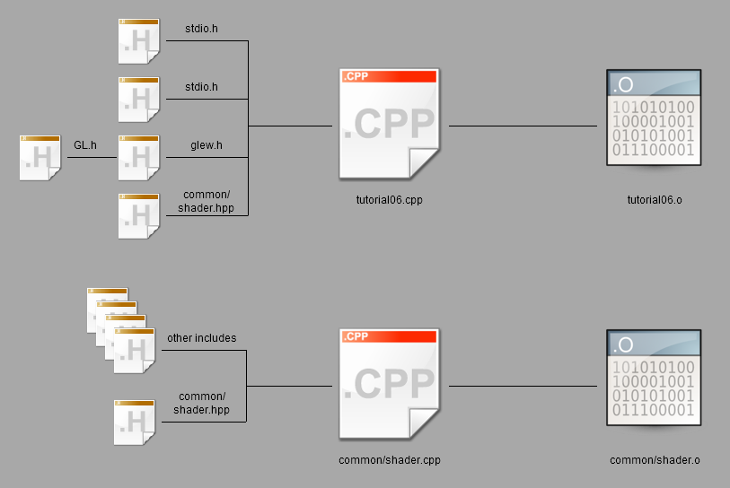
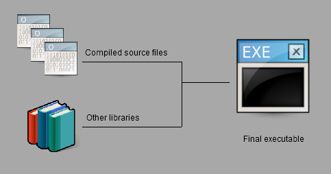
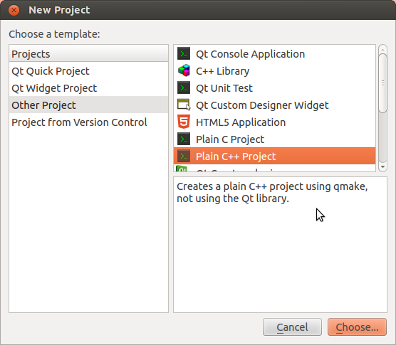
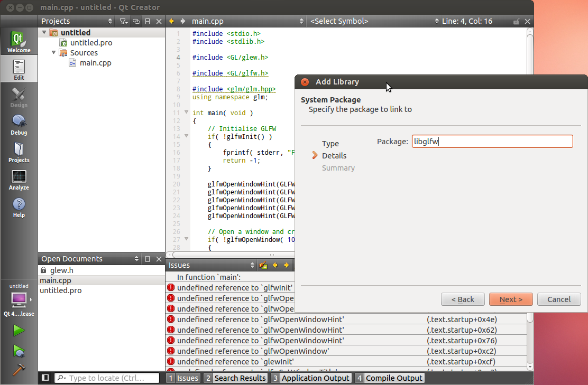

Building your own C application
===============================

A lot of efforts have been made so that these tutorials are as simple to
compile & run as possible. Unfortunately, this also means that CMakes
hides how to do that on your own project.

So, this tutorial will explain how to build your own C application from
scatch. But first, you need a basic knowledge of what the compiler
actually does.

<span style="color: #ff0000;">Please don’t skip the first two sections.
If you’re reading this tutorial, you probably need to know this
stuff.</span>

The C application model
=======================

Preprocessing
-------------

This is what all those *\#defines* and *\#includes* are about.

C preprocessing is a very simple process : cut’n pasting.

When the preprocessor sees the following MyCode.c :

<div class="language-cpp highlighter-rouge">

``` {.highlight}
#include "MyHeader.h"

void main(){
    FunctionDefinedInHeader();
}
```

</div>

, it simply opens the file MyHeader.h, and cut’n pastes its contents
into MyCode.c :

<div class="language-c highlighter-rouge">

``` {.highlight}
// Begin of MyCode.c
// Begin of MyHeader.h
#ifndef MYHEADER_H
#define MYHEADER_H

void FunctionDefinedInHeader(); // Declare the function

# endif
// End of MyHeader.h

void main(){
    FunctionDefinedInHeader(); // Use it
}

// End of MyCode
```

</div>

Similarly, *\#define*s are cut’n pasted, *\#if*s are analysed and
potentially removed, etc.

At the end of this step we have a preprocessed C++ file, without any
\#define, \#if, \#ifdef, \#include, ready to be compiled.

As an example, here is the main.cpp file of the 6th tutorial, fully
preprocessed in Visual :
[tutorial06\_preprocessed](http://www.opengl-tutorial.org/assets/images/build-own-app/tutorial06_preprocessed.txt).
Warning, it’s a huge file ! But it’s worth knowing what a seemingly
simple .cpp really looks to the compiler.

Compilation
-----------

The compiler translates C++ code into a representation that the CPU can
directly understand. For instance, the following code :

<div class="language-cpp highlighter-rouge">

``` {.highlight}
int i=3;
int j=4*i+2;
```

</div>

will be translated into this : x86 opcodes.

<div class="highlighter-rouge">

``` {.highlight}
mov         dword ptr [i],3
mov         eax,dword ptr [i]
lea         ecx,[eax*4+2]
mov         dword ptr [j],ecx
```

</div>

Each .cpp file is compiled separately, and the resulting binary code is
written in .o/.obj files.



Note that we don’t have an executable yet : one remaining step is
needed.

Linking
-------

The linker takes all the binary code (yours, and the one from external
libraries), and generates the final executable. A few notes :

-   A library has the .lib extension.
-   Some libraries are *static*. This means that the .lib contains all
    the x86 opcodes needed.
-   Some library are *dynamic* ( also said *shared* ). This means that
    the .lib doesn’t contain any x86 code; it simply says “I swear that
    functions *Foo*, *Bar* and *WhatsNot* will be available at runtime”.

When the linker has run, you have an executable (.exe on Windows,
.nothing\_at\_all on unix) :



Runtime
-------

When you launch the executable, the OS will open the .exe, and put the
x86 opcodes in memory. As said earlier, some code isn’t available at
this point : the code from dynamic libraries. But the linker was nice
enough to say where to look for it : the .exe clearly says that the
glClearColor function is implemented in OpenGL32.dll.


Windows will happily open the .dll and find glClearColor :


Sometimes a .dll can’t be found, probably because you screwed the
installation process, and the program just can’t be run.


How do I do X with IDE Y ? {#how-do-i-do-x-with-ide-y-}
==========================

The instructions on how to build an OpenGL application are separated
from the following basic operations. This is on purpose :

-   First, you’ll need to do these thinks all of the time, so you’d
    better know them well
-   Second, you will know what is OpenGL-specific and what is not.

Visual Studio
-------------

### Creating a new project

File -\> New -\> Project -\> Empty project. Don’t use any weird wizard.
Don’t use any option you may not know about (disable MFC, ATL,
precompiled headers, stdafx, main file).

### Adding a source file in a project

Right clic on Source Files -\> Add new.

### Adding include directories

Right clic on project -\> Project Properties -\> C++ -\> General -\>
Additional include directories. This is actually a dropdown list, you
can modify the list conveniently.

### Link with a library

Right clic on project -\> Project Properties -\> Linker -\> Input -\>
Additional dependencies : type the name of the .lib. For instance :
opengl32.lib

In Project Properties -\> Linker -\> General -\> Additional library
directories, make sure that the path to the above library is present.

### Build, Run & Debug {#build-run--debug}

Setting the working directory (where your textures & shaders are) :
Project Properties -\> Debugging -\> Working directory

Running : Shift-F5; but you’ll probably never need to do that. *Debug*
instead : F5

A short list of debugging shortcuts :

-   F9 on a line, or clicking on the left of the line number: setting a
    breakpoint. A red dot will appear.
-   F10 : execute current line
-   F11 : execute current line, but step into the functions this line is
    calling (“step into”)
-   Shift-F11 : run until the end of the function (“step out”)

You also have plenty of debugging windows : watched variables,
callstack, threads, …

QtCreator
---------

QtCreator is available for free at <http://qt-project.org/>.

### Creating a new project

Use a plain C or C++ project; avoid the templates filled with Qt stuff.



Use default options.

### Adding a source file in a project

Use the GUI, or add the file in the .pro :

    SOURCES += main.cpp \
               other.cpp \
               foo.cpp

### Adding include directories

In the .pro file :

<div class="highlighter-rouge">

``` {.highlight}
<code>INCLUDEPATH += <your path> \ <other path> </code>
```

</div>

### Link with a library

Right clic on project -\> Add library

-   If you’re on Linux and you installed the library with apt-get or
    similar, chances are that the library registered itself in the
    system. You can select “System package” and enter the name of the
    library ( ex : *libglfw* or *glew* )



-   If not, use “System Library”. Browse to where you compiled it.

### Build, Run & Debug {#build-run--debug-1}

Building : Ctrl-B, or the hammer on the bottom left corner.

Running : the green arrow. You can set the program’s arguments and
working directory in Projects -\> Run Settings

Debugging :

-   Setting a breakpoint : Click on the left of the line number. A red
    dot will appear.
-   F10 : execute current line
-   F11 : execute current line, but step into the functions this line is
    calling (“step into”)
-   Shift-F11 : run until the end of the function (“step out”)

You also have plenty of debugging windows : watched variables,
callstack, threads, …

XCode
-----

Work in progress…

### Creating a new project

### Adding a source file in a project

### Adding include directories

### Link with a library

### Build, Run & Debug {#build-run--debug-2}

CMake
-----

CMake will create projects for almost any software building tool :
Visual, QtCreator, XCode, make, Code::Blocks, Eclipse, etc, on any OS.
This frees you from maintaining many project files.

### Creating a new project

Create a CMakeLists.txt file and write the following inside (adapt if
needed) :

<div class="highlighter-rouge">

``` {.highlight}
cmake_minimum_required (VERSION 2.6)
project (your_project_name)

find_package(OpenGL REQUIRED)

add_executable(your_exe_name
    tutorial04_colored_cube/tutorial04.cpp
    common/shader.cpp
    common/shader.hpp
)
```

</div>

Launch the CMake GUI, browse to your .txt file, and select your build
folder. Click Configure, then Generate. Your solution will be created in
the build folder.

### Adding a source file in a project

Simply add a line in the add\_executable command.

### Adding include directories

<div class="highlighter-rouge">

``` {.highlight}
include_directories(
    external/AntTweakBar-1.15/include/
    external/glfw-2.7.2/include/
    external/glm-0.9.1/
    external/glew-1.5.8/include/
    .
)
```

</div>

### Link with a library

<div class="highlighter-rouge">

``` {.highlight}
set(ALL_LIBS
    ${OPENGL_LIBRARY}
    GLFW_272
    GLEW_158
    ANTTWEAKBAR_151_OGLCORE_GLFW
)

target_link_libraries(tutorial01_first_window
    ${ALL_LIBS}
)
```

</div>

### Build, Run & Debug {#build-run--debug-3}

CMake doesn’t do that. Use your favourite IDE.

make
----

Please, just don’t use that.

gcc
---

It might be worth compiling a small project “by hand” in order to gain a
better comprehension of the workflow. Just don’t do this on a real
project…

Note that you can also do that on Windows using mingw.

Compile each .cpp file separately :

<div class="language-bash highlighter-rouge">

``` {.highlight}
g++ -c main.cpp
g++ -c tools.cpp
```

</div>

<div id=":2v">

</div>

As said above, you will have a main.o and a tools.o files. Link them :

<div class="language-bash highlighter-rouge">

``` {.highlight}
g++ main.o tools.o
```

</div>

a *a.out* file appeared; It’s your executable, run it :

<div class="language-bash highlighter-rouge">

``` {.highlight}
./a.out
```

</div>

That’s it !

Building your own C application {#building-your-own-c-application}
===============================

Armed with this knowledge, we can start building our own OpenGL
application.

-   Download the dependencies : Here we use GLFW, GLEW and GLM, but
    depending on your project, you might need something different. Save
    same preferably in a subdirectory of your project (for instance :
    external/)
-   They should be pre-compiled for your platform. GLM doesn’t have to
    be compiled, though.
-   Create a new project with the IDE of your choice
-   Add a new .cpp file in the project
-   Copy and paste, for instance, the following code (this is actually
    playground.cpp) :

<div class="language-cpp highlighter-rouge">

``` {.highlight}
#include <stdio.h>
#include <stdlib.h>

#include <GL/glew.h>

#include <GL/glfw.h>

#include <glm/glm.hpp>
using namespace glm;

int main( void )
{
    // Initialise GLFW
 if( !glfwInit() )
    {
        fprintf( stderr, "Failed to initialize GLFW\n" );
        return -1;
    }

    glfwOpenWindowHint(GLFW_FSAA_SAMPLES, 4);
    glfwOpenWindowHint(GLFW_WINDOW_NO_RESIZE,GL_TRUE);
    glfwOpenWindowHint(GLFW_OPENGL_VERSION_MAJOR, 3);
    glfwOpenWindowHint(GLFW_OPENGL_VERSION_MINOR, 3);
    glfwOpenWindowHint(GLFW_OPENGL_PROFILE, GLFW_OPENGL_CORE_PROFILE);

    // Open a window and create its OpenGL context
 if( !glfwOpenWindow( 1024, 768, 0,0,0,0, 32,0, GLFW_WINDOW ) )
    {
        fprintf( stderr, "Failed to open GLFW window. If you have an Intel GPU, they are not 3.3 compatible. Try the 2.1 version of the tutorials.\n" );
        glfwTerminate();
        return -1;
    }

    // Initialize GLEW
 if (glewInit() != GLEW_OK) {
        fprintf(stderr, "Failed to initialize GLEW\n");
        return -1;
    }

    glfwSetWindowTitle( "Playground" );

    // Ensure we can capture the escape key being pressed below
 glfwEnable( GLFW_STICKY_KEYS );

    // Dark blue background
 glClearColor(0.0f, 0.0f, 0.3f, 0.0f);

    do{
        // Draw nothing, see you in tutorial 2 !

        // Swap buffers
     glfwSwapBuffers();

    } // Check if the ESC key was pressed or the window was closed
 while( glfwGetKey( GLFW_KEY_ESC ) != GLFW_PRESS &&
           glfwGetWindowParam( GLFW_OPENED ) );

    // Close OpenGL window and terminate GLFW
 glfwTerminate();

    return 0;
}
```

</div>

-   Compile the project.

You will have many compiler errors. We will analyse all of them, one by
one.

Troubleshooting
===============

The error messages below are for Visual Studio 2010, but they are more
or less similar on GCC.

Visual Studio - fatal error C1083: Cannot open filetype file: ‘GL/glew.h’ : No such file or directory {#visual-studio---fatal-error-c1083-cannot-open-filetype-file-glglewh--no-such-file-or-directory}
-----------------------------------------------------------------------------------------------------

(or whichever other file)

Some headers are in weird locations. For instance, GLEW include files
are located in external/glew-x.y.z/include/. The compiler has no way to
magically guess this, so you have to tell him. In the project settings,
add the appropriate path in the COMPILER (not linker) options.

Under *no circumstance* you should copy files in the compiler’s default
directory (Program Files/Visual Studio/…). Technically, this will work,
but it’s *very* bad practice.

Also, it’s good practice to use relative paths ( ./external/glew/…
instead of C:/Users/username/Downloads/… )

As an example, this is what the tutorial’s CMake use :

<div class="highlighter-rouge">

``` {.highlight}
external/glfw-2.7.2/include
external/glm-0.9.1
external/glew-1.5.8/include
```

</div>

Repeat until all files are found.

GCC - fatal error: GL/glew.h: No such file or directory {#gcc---fatal-error-glglewh-no-such-file-or-directory}
-------------------------------------------------------

(or whichever other file)

This means that the library is not installed. If you’re lucky, the
library is well-known and you just have to install it. This is the case
for GLFW, GLEW and GLM :

<div class="language-bash highlighter-rouge">

``` {.highlight}
sudo apt-get install libglfw-dev libglm-dev libglew1.6-dev
```

</div>

If this is not a widespread library, see the answer for Visual Studio
above.

Visual Studio - error LNK2019: unresolved external symbol glfwGetWindowParam referenced in function main
--------------------------------------------------------------------------------------------------------

(or whichever other symbol in whichever other function)

Congratulations ! You have a linker error. This is excellent news : this
means that the compilation succeeded. Just one last step !

glfw functions are in an external library. You have to tell the linker
about this library. Add it in the linker options. Don’t forget to add
the path to the library.

As an **example**, this is what the Visual project use. The names are a
bit unusual because this is a custom build. What’s more, GLM doesn’t
need to be compiled or linked, so it’s not here.

<div class="highlighter-rouge">

``` {.highlight}
external\Debug\GLFW_272.lib
external\Debug\GLEW_158.lib
```

</div>

If you download these libraries from SourceForge
([GLFW](http://www.glfw.org/download.html),
[GLEW](http://glew.sourceforge.net/index.html)) and build a library
yourself, you have to specify the correct path. For instance :

<div class="highlighter-rouge">

``` {.highlight}
C:\Where\You\Put\The\Library\glfw.lib
C:\Where\You\Put\The\Other\Library\glew32.lib
```

</div>

GCC - main.cpp: undefined reference to \`glfwInit’ {#gcc---maincpp-undefined-reference-to-glfwinit}
--------------------------------------------------

(or whichever other symbol in whichever other file)

Same answer than for Visual Studio.

Note that on Linux, GLFW and GLEW (and many others) are usually
installed with apt-get or similar : sudo apt-get install libglew-dev
libglfw-dev (may vary). When you do that, the library is copied in the
compiler’s standard directory, so you don’t have to specify the path.
Just link to glfw and glew as shown in the 1rst section.

I set everything right, but I still have an “unresolved external symbol” error ! {#i-set-everything-right-but-i-still-have-an-unresolved-external-symbol-error-}
--------------------------------------------------------------------------------

This might me tricky to track down. Here are several options:

### I have a linker error with \_imp\_glewInit or some other symbol that begins with \_imp

This means that the library (in this case, glew) has been compiled as a
*static* library, but you’re trying to use it as a *dynamic* library.
Simply add the following preprocessor directive in your compiler’s
options (for your own project, not glew’s) :

<div class="highlighter-rouge">

``` {.highlight}
GLEW_STATIC
```

</div>

### I have some other weird problem with GLFW

Maybe GLFW was built as a dynamic library, but you’re trying to use it
as a static one ?

Try adding the following preprocessor directive :

<div class="highlighter-rouge">

``` {.highlight}
GLFW_DLL
```

</div>

### I have another linker problem ! Help me, I’m stuck ! {#i-have-another-linker-problem--help-me-im-stuck-}

Please send us a detailed report and a fully featured zipped project,
and we’ll add instructions.

### I’d like to solve this myself. What are the generic rules ? {#id-like-to-solve-this-myself-what-are-the-generic-rules-}

Let’s say you’re the author of GLFW. You want to provide the function
glfwInit().

When building it as a DLL, you have to tell the compiler that glfwInit()
is not like any other function in the DLL : it should be seen from
others, unlike glfwPrivateImplementationMethodNobodyShouldCareAbout().
This is done by declaring the function “external” (with GCC) or
“\_\_declspec(dllexport)” (with Visual).

When you want to use glfw, you need to tell the compiler that this
function is not really available : it should link to it dynamically.
This is done by declaring the function “external” (with GCC) or
“\_\_declspec(dllimport)” (with Visual).

So you use a handy \#define : GLFWAPI, and you use it to declare the
functions :

GLFWAPI int glfwInit( void );

-   When you’re building as a DLL, you \#define GLFW\_BUILD\_DLL.
    GLFWAPI then gets \#define’d to \_\_declspec(dllexport)
-   When you’re using GLFW as a DLL, you \#define GLFW\_DLL. GLFWAPI
    then gets \#define’d to \_\_declspec(dllimport)
-   When you’re building as a static lib, GLFWAPI is \#define’d to
    nothing
-   When you’re using GLFW as a static lib, GLFWAPI is \#define’d to
    nothing.

So the rule is : these flags must be consistent. If you build a lib (any
lib, not just GLFW) as a DLL, use the right preprocessor definition :
GLFW\_DLL, GLEW\_STATIC

My program crashes ! {#my-program-crashes-}
--------------------

There are many reasons why a C++ OpenGL application might crash. Here
are a few. If you don’t know the exact line where your program crashes,
learn how to use a debugger ( see shortcuts above). PLEASE don’t debug
with printf().

### I don’t even go inside main()

This is most probably because some dll could not be found. Try opening
your application with Dependency Walker (Windows) or ldd (Linux; try
also
[this](http://stackoverflow.com/questions/6977298/dependency-walker-equivalent-for-linux))

### My program crashes on glfwOpenWindow(), or any other function that creates an OpenGL context

Several possible reasons :

-   Your GPU doesn’t support the requested OpenGL version. Try to see
    the supported version with GPU Caps Viewer or similar. Update driver
    if it seems too low. Integrated Intel cards on netbooks especially
    suck. Use a lower version of OpenGL (2.1 for instance), and use
    extensions if you lack features.
-   Your OS doesn’t support the requested OpenGL version : Mac OS… same
    answer.
-   You’re trying to use GLEW with an OpenGL Core context (i.e. without
    all the deprecated stuff). This is a GLEW bug. Use
    glewExperimental=true before glewInit(), or use a compatibility
    profile ( i.e. use GLFW\_OPENGL\_COMPAT\_PROFILE instead of
    GLFW\_OPENGL\_CORE\_PROFILE )

My program crashes on the first OpenGL call, or on the first buffer creation
----------------------------------------------------------------------------

Three possible reasons :

-   You’re not calling glewInit() AFTER glfwOpenWindow()
-   You’re using a core OpenGL profile, and you didn’t create a VAO. Add
    the following code after glewInit() :

<div class="language-cpp highlighter-rouge">

``` {.highlight}
   GLuint VertexArrayID;
    glGenVertexArrays(1, &VertexArrayID);
    glBindVertexArray(VertexArrayID);
```

</div>

-   You’re using the default build of GLEW, which has a bug. You can’t
    use a Core OpenGL Profile due to this bug. Either Use
    glewExperimental=true before glewInit(), or ask GLFW for a
    Compatibility Profile instead :

<div class="language-cpp highlighter-rouge">

``` {.highlight}
    glfwOpenWindowHint(GLFW_OPENGL_PROFILE, GLFW_OPENGL_COMPAT_PROFILE);
```

</div>

My program crashes when I try to load some file
-----------------------------------------------

Setup your working directory correctly. See Tutorial 1.

Create a test.txt file and try the following code :

<div class="language-cpp highlighter-rouge">

``` {.highlight}
if ( fopen("test.txt", "r" ) == NULL ){
    printf("I'm probably running my program from a wrong folder");
}
```

</div>

<span style="color: #ff0000;">USE THE DEBUGGER !!!! </span>Seriously !
Don’t debug with printf(); use a good IDE.
<http://www.dotnetperls.com/debugging> is for C\# but is valid for C++
too. Will vary for XCode and QtCreator, but concepts remain exactly the
same.
